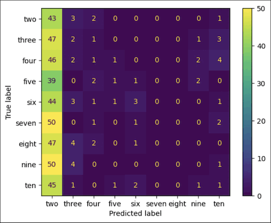

# CountCLIP : [Re] Teaching Clip to Count to Ten

This repository contains the implementation of the paper [Teaching Clip to Count to Ten](https://arxiv.org/abs/2302.12066) by Google Research, published in ICCV 2023. This paper presented a method to fine-tune Vision-Language Models (VLMs), like [CLIP](https://arxiv.org/abs/2103.00020), to improve zero-shot counting accuracy in an image while maintaining the performance for zero-shot classification by introducing a counting-contrastive loss term to the original loss function. This changes the training objective to discriminate between the correct and the incorrect captions associated with the object counts in an image.

  Demo of our model learning to count

### Usage

Open model.ipynb and run all the cells

### Repository structure 

* count_set_gen.ipynb contains the implementation for generating the counting set as described in Section 3.1 of the paper.
* model.ipynb contains the implementation for the counting loss function as described in Section 3.2 of the paper.
* The folder data_utils contains miscellaneous notebooks for downloading data, merging datasets etc.
    * download.ipynb and cb_download.ipynb were used for downloading the training and validation data respectively.
    * create_json.ipynb and merge.ipynb were used to create and merge the JSON files for the data.
    * parse_faulty.ipynb was used to compile non-functional images into a single file.
* The folder [ld contains incomplete and outdated code used to make the final implementation.

### Dataset

We have created a small counting set of ~2000 images after passing over 2 million images out of the 400 million present in the original dataset.
This is merged with ~13000 non-counting images from the same dataset. The entire merged dataset, along with the required relevant JSON/CSV files, can be found below.

* [data.zip](https://drive.google.com/file/d/1UG_bXl_vgCdVq3kgf8Y-StXPCttlpFAG/view?usp=sharing) - merged counting and noncounting data, along with the validation data (the [CountBench](https://github.com/teaching-clip-to-count/teaching-clip-to-count.github.io/blob/main/CountBench.json) dataset).
* [merged.json](https://drive.google.com/file/d/13mdK-jX_eDNa5v-HB34WOS3WNHSru_ir/view?usp=drive_link) - JSON for merged (counting+noncounting) data.
* [val.json](https://drive.google.com/file/d/1h9FV9dVvcvLo97reN9_2dbg0QFKyVED2/view?usp=drive_link) - JSON for the CountBench data.
* [faulty.csv](https://drive.google.com/file/d/1es9gtEtl1yiX4DVFRI_Qi0fQg0R9qUO2/view?usp=drive_link) - CSV for removing faulty noncounting images.

### Special Thanks
* https://github.com/shashnkvats/Indofashionclip/tree/main
* https://github.com/teaching-clip-to-count/teaching-clip-to-count.github.io/
* https://github.com/ultralytics/ultralytics
